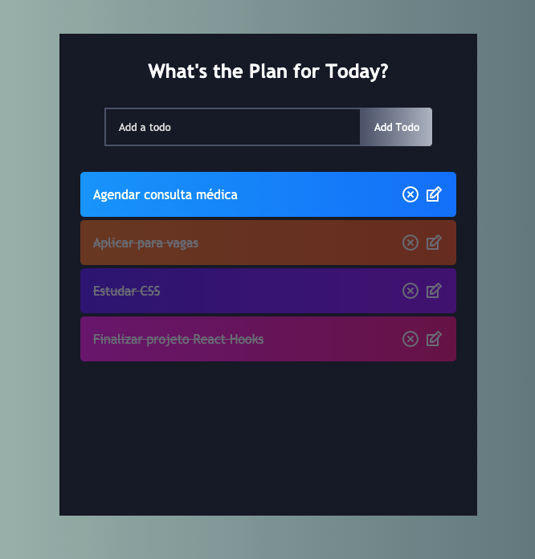

    
    <h1>
        ToDo App - React Hooks
    </h1>
    <h4>
      Projeto realizado em cima do tutorial disponibilizado por <a href="https://www.youtube.com/watch?v=E1E08i2UJGI">Brian Design</a>
    </h4>
     
     

  
   
   ---

   
   

<h2 id="conteudos">Conteúdos</h2>

[➜ Sobre o projeto](#mag_right-sobre-o-projeto) 
[➜ O que aprendi](#books-o-que-aprendi) 

---

## :mag_right: Sobre o projeto

O objetivo do projeto foi colocar em prática os conceitos básicos sobre <b>React Hooks</b> através de um gerenciador de tarefas com funções de adicionar, excluir, editar e completar uma tarefa.

---

## :books: O que aprendi

- Praticar o uso de <i>useState()</i>;
- Praticar o uso de <i>useRef</i> combinado com <i>useEffect()</i>;
- Fazer uma lista de renderização com <i>.map()</i>
